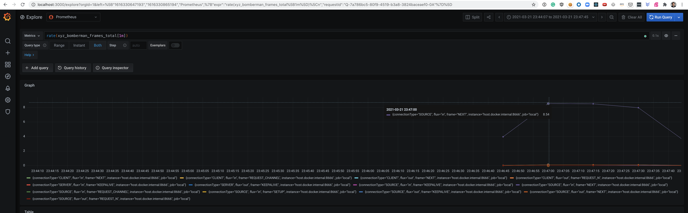

docke# Metrics

## Start

```bash
docker compose up
open "http://localhost:3000/" # admin/admin
```

## Reporter

```java
.interceptors(registry -> {
  registry.forConnection(new MetricsRsConnectionInterceptor(Metrics.REGISTRY));
  registry.forResponder(new MetricsResponderInterceptor(Metrics.REGISTRY));
}) //
```

## Collector

```bash
cd metrics 
docker compose up
open http://localhost:3000 # admin/admin
```




